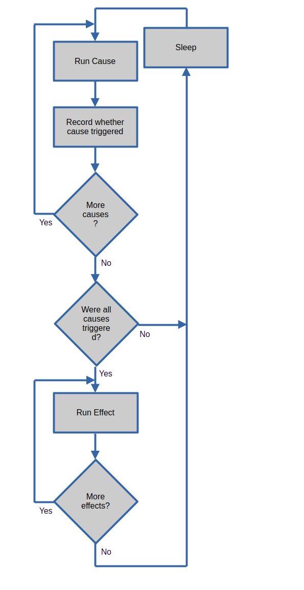

adaptived is a simple yet extremely powerful and flexible cause-and-effect
daemon.  Users can use adaptived to construct a series of custom rules to
automate tasks, manage resources, kill processes, etc.  When used in
conjunction with cgroups, adaptived can adjust system performance and settings
in realtime to adapt to a changing workload.

Adaptived has several built-in causes and effects.  When using only the built-in
causes and effects, adaptived can be invoked directly by calling the adaptived
daemon.  See the [Getting Started Section](https://github.com/oracle/adaptivemm/tree/readme/adaptived#getting-started).
To use custom cause and effects, a user must use the adaptived library
and its C APIs.  See the [Advanced Use Case Section](https://github.com/oracle/adaptivemm/tree/readme/adaptived#advanced-use-case---custom-causes-andor-effects).
If there is sufficient demand, we may consider adding Python
bindings.

## Terminology

Adaptived uses the following terminology:

* Cause - A cause is an event or measurement that can be used to trigger an
  effect.  Multiple causes can be connected together in series in a rule.  In
  cases like this, the causes will be processed in the order they are
  enumerated in the configuration file.  All causes in a given rule are run
  every loop through adaptived.  Effects will only be invoked if all of the
  causes in the rule are triggered.
* Effect - An effect is an action to be taken when the cause(s) in the same
  rule are triggered.  Multiple effects can be connected together in a rule.
  Baring an error, each effect will run when the associated causes are
  triggered.
* Rule - A rule is one or more causes combined with one or more effects. When
  all of the causes in the rule are triggered, then the effect(s) will be
  executed.  An adaptived configuration file can contain multiple rules.

## Architecture

Adaptived's main processing loop operates as shown in the flow chart below:



## Getting Started

If a user only wants to utilize the built-in causes and effects in adaptived,
then they can invoke the daemon directly.

For example, given this [configuration file](./doc/examples/jimmy-buffett-config.json),
a user could start adaptived as follows:
```
adaptived -c ./doc/examples/jimmy-buffett-config.json -i 3 
```

The above command will start the adaptived daemon.  It will employ the rules
outlined in the provided configuration file, and the main adaptived loop will run
every 3 seconds.

Given the rule in this example, adaptived will print `It's 5 o'clock here :)` when
the time is after 5 pm and it's a weekday.  It will print that message until
midnight, and then the `time_of_day` cause will no longer trigger.  Since no maximum
number of loops was provided in this example, adaptived will continue running until
it is killed.  Once it's after 5 pm and a weekday, then the print effect will again
run and output the aforementioned message.

## Real-World Use Cases

* Given two cgroups, high-priority and low-priority, kill processes in the
  low-priority cgroup when there is PSI pressure on the high-priority cgroup
  [[1]](./doc/examples/kill-lowpriority.json)
* Given two cgroups, high-priority and low-priority, reduce the cpu.weight
  of the low-priority cgroup when there is PSI pressure on the high-priority
  cgroup.  Conversely, when there is very little pressure on the high-priority
  cgroup, increase the cpu.weight of the low-priority cgroup
  [[2]](./doc/examples/adjust-weight.json)
* Adjust a cgroup's soft memory limit (memory.high) to determine the minimum
  memory requirements of an application.  This value could be used to
  populate that application's memory.low cgroup setting
  [[3]](./doc/examples/determine-memorylow.json)
* When an anomalous event occurs, save critical logs off for later offline
  evaluation and troubleshooting
  [[4]](./doc/examples/topmem-savelogs.json)
* When the system's MemFree field falls below a threshold, send a signal to a
  monitoring process
  [[5]](./doc/examples/lowmemfree-sendsignal.json)

## Advanced Use Case - Custom Causes and/or Effects

Adaptived allows for users to create their own custom causes and effects.  (Note
that pull requests are encouraged, and we encourage users to submit new causes
and effects to the adaptived library so that they can be built in.  But we realize
that some causes and/or effects may be proprietary or just too obscure to add
to the main library.)

To utilize custom causes and/or effects, the user must employ the adaptived
library and its C APIs.  The automated test,
[003-register_plugin_cause.c](./tests/ftests/003-register_plugin_cause.c),
is a good starting point.

## Schema

An example adaptived JSON configuration file is attached below.  Note that the
`comment` fields are for illustrative purposes and are not required.  (In fact,
adaptived will ignore fields that aren't part of its schema.  As outlined
below, these ignored fields could be a way to document the configuration
file.)

```
{
    "comment1": "adaptived configuration files consist of one or more rules.",
    "comment2": "The rules are processed independent of each other,",
    "comment3": "therefore ensure that one rule doesn't adversely affect another rule.",
    "rules": [
        {
            "name": "We recommend a short but descriptive rule name",
            "comment1": "The rule name must be unique as the name is used as the built-in identifier",
            "comment2": "Also, the rule name is displayed in debug logs, so a short-but-descriptive name is very helpful in debugging",
            "description": "Optional but helpful for further describing the rule.",

            "causes comment1": "A rule consists of one of more causes.",
            "causes comment2": "Every cause is run every time the main adaptived processing loop runs.",
            "causes comment3": "Every cause must trigger for the effect(s) to be run.",
            "currently-supported causes": "https://github.com/oracle/adaptivemm/blob/master/adaptived/doc/internal/list-of-built-in-causes.md",
            "causes": [
                {
                    "name": "cause 1 name",
                    "args": {
                        "comment1": "Each cause has its own set of args applicable to that cause.",
                        "comment2": "See the list of built-in causes for the args supported by each cause"
                    }
                },
                {
                    "name": "cause 2 name",
                    "comment1": "Even if cause 1 does not trigger, this cause will be evaluated every time the adaptived processing loop runs.",
                    "comment2": "This is critical so that averages, trends, etc. can be properly computed.",
                    "args": {}
                }
            ],

            "effects comment1": "A rule consists of one or more effects.",
            "effects comment2": "The effect(s) will only be run if every cause in this rule triggers.",
            "currently-supported effects": "https://github.com/oracle/adaptivemm/blob/master/adaptived/doc/internal/list-of-built-in-effects.md",
            "effects": [
                {
                    "name": "effect 1 name",
                    "args": {
                        "comment1": "Just like with the causes, each effect has its own set of args applicable to that effect.",
                        "comment2": "See the list of built-in effects for the args supported by each effect."
                    }
                },
                {
                    "name": "effect 2 name",
                    "args": {}
                }
            ]
        },

        {
            "name": "When MemFree falls below 2 GB, send SIGALRM (signal 14) to the monitoring program",
            "causes": [
                {
                    "name": "meminfo",
                    "args": {
                        "field": "MemFree",
                        "threshold": "2G",
                        "operator": "lessthan"
                    }
                }
            ],
            "effects": [
                {
                    "name": "signal",
                    "args": {
                        "proc_names": [
                            {
                                "name": "monitor_program"
                            }
                        ],
                        "signal": 14
                    }
                }
            ]
        }
    ]
}
```

## Additional Resources

* [List of Built-In Causes](./doc/internal/list-of-built-in-causes.md)
* [List of Built-In Effects](./doc/internal/list-of-built-in-effects.md)

## Documentation

The "doc/" directory contains all of the currently available documentation.
The top level directory also contains a README.md file (this file) as well
as the LICENSE and CONTRIBUTING.md files.

Those who are interested in contributing to the project are encouraged to
read the CONTRIBUTING.md in the top level directory.

## Verifying Release Tarballs

Before use you should verify the downloaded release tarballs and checksums
using the detached signatures supplied as part of the release; the detached
signature files are the "*.asc" files.  If you have GnuPG installed you can
verify detached signatures using the following command:

	# gpg --verify file.asc file

At present, only the following keys, specified via the fingerprints below, are
authorized to sign official adaptived releases:

	Tom Hromatka <tom.hromatka@oracle.com>
	47A6 8FCE 37C7 D702 4FD6  5E11 356C E62C 2B52 4099

More information on GnuPG can be found at their website, https://gnupg.org.

## Building and Installing the Library

If you are building the adaptived library from an official release tarball,
you should follow the familiar three step process used by most autotools based
applications:

	# ./configure
	# make [V=0|1]
	# make install

However, if you are building the library from sources retrieved from the source
repository you may need to run the autogen.sh script before running configure.
In both cases, running `./configure -h` will display a list of build-time
configuration options.

## Testing the Library

There are a number of tests located in the "tests/" directory and a make target
which can be used to help automate their execution.  If you want to run the
standard regression tests you can execute the following after building the
library:

	# make check

These tests can be safely run on any Linux system.  Note that the test run
may take a significant amount of time and produce a lot of output.
